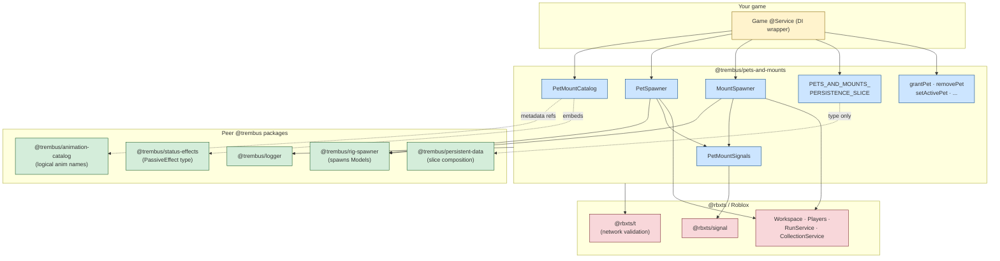
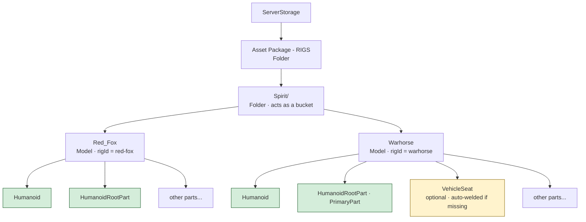
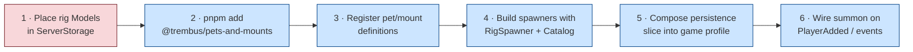
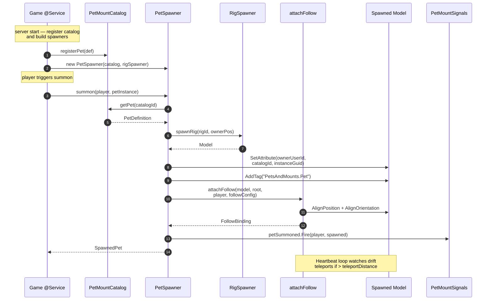
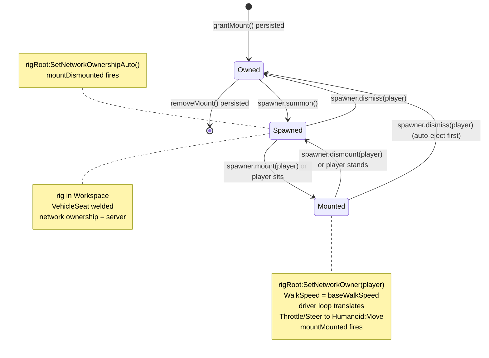
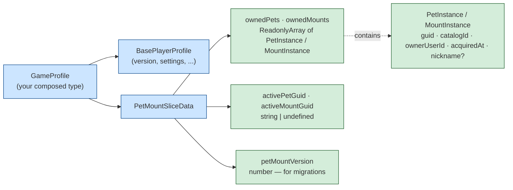

# `@trembus/pets-and-mounts` — Overview & Setup

> Visual reference for the package. Open in VS Code with the Mermaid Preview extension, or view on GitHub — Mermaid blocks render inline in both.

## What this package gives you

A reusable, framework-agnostic system for **summonable companion creatures** in roblox-ts games:

- **Pets** — followers that track the owner via physics-based movement (AlignPosition + AlignOrientation, not `Humanoid:MoveTo`)
- **Mounts** — rideable rigs with `VehicleSeat` + explicit network-ownership handoff
- **Open registry catalog** — game registers pet/mount definitions at startup (no codegen)
- **Persistence slice** — owned items + active selection persist via `@trembus/persistent-data`
- **Pure transactions** — `grantPet`, `setActiveMount`, etc. return immutable `{ ok, data }` results
- **Module-level signal bus** — subscribe once at startup; no mount-after-fire races

---

## 1 · Package composition

How `pets-and-mounts` plugs into the rest of the `@trembus/*` stack and the Roblox runtime.



---

## 2 · Studio asset layout

The package delegates Model spawning to `@trembus/rig-spawner`, which expects this layout in `ServerStorage`:



| Requirement | Why |
|---|---|
| Model has a `Humanoid` child | `rig-spawner` rejects models without one |
| Model has a `HumanoidRootPart` (BasePart) | follow-behavior anchors `AlignPosition` here; mount-seat sets network ownership on this part |
| `Model.PrimaryPart` set (preferably to HRP) | mount-seat falls back to HRP, but PrimaryPart is preferred |
| **Mount only** — a `VehicleSeat` child | optional; `attachSeat` welds one at your `seatOffset` if missing |

**Faction caveat:** `rig-spawner` only accepts folder names matching the hardcoded `Faction` enum (`Blood`, `Decay`, `Fateless`, `Robots`, `Spirit`). Pets/mounts don't fit naturally — pick one as a bucket (e.g. `Spirit/`), or call `rigSpawner.scanFolder(customFolder)` / `rigSpawner.registerRig({...})` to skip auto-discovery entirely.

---

## 3 · Setup checklist



---

## 4 · Server-side code skeleton

```ts
import { Players, ServerStorage } from "@rbxts/services";
import { RigSpawner } from "@trembus/rig-spawner";
import {
  PetMountCatalog, PetSpawner, MountSpawner,
  PETS_AND_MOUNTS_PERSISTENCE_SLICE,
  grantPet, setActivePet, getActivePet,
  type PetMountSliceData,
} from "@trembus/pets-and-mounts";
import {
  composeProfile, DEFAULT_PROFILE_TEMPLATE, PersistentDataManager,
  type BasePlayerProfile,
} from "@trembus/persistent-data";

// 1 — rigs
const rigSpawner = new RigSpawner();
rigSpawner.initialize(); // scans "Asset Package - RIGS"

// 2 — catalog
const catalog = new PetMountCatalog();
catalog.registerPet({
  catalogId: "pet_fox_red",
  displayName: "Red Fox",
  rigId: "red-fox",
  anims: { idle: "creature.fox.idle", walk: "creature.fox.walk" },
});
catalog.registerMount({
  catalogId: "mount_warhorse",
  displayName: "Warhorse",
  rigId: "warhorse",
  anims: { idle: "mount.horse.idle", walk: "mount.horse.walk", run: "mount.horse.run" },
  seatOffset: new Vector3(0, 3.5, 0),
  baseWalkSpeed: 32,
});

// 3 — spawners
const petSpawner = new PetSpawner(catalog, rigSpawner);
const mountSpawner = new MountSpawner(catalog, rigSpawner);

// 4 — persistence
type GameProfile = BasePlayerProfile & PetMountSliceData;
const { template, onLoad } = composeProfile<GameProfile>(
  DEFAULT_PROFILE_TEMPLATE as GameProfile,
  [PETS_AND_MOUNTS_PERSISTENCE_SLICE],
);
const profiles = new PersistentDataManager<GameProfile>({ template, onLoad });

// 5 — player flow
Players.PlayerAdded.Connect((player) => {
  const profile = profiles.loadProfile(player);
  if (!profile) return;
  const active = getActivePet(profile.Data);
  if (active) petSpawner.summon(player, active);
});

Players.PlayerRemoving.Connect((player) => {
  petSpawner.dismiss(player);
  mountSpawner.dismiss(player);
});
```

---

## 5 · Pet summon — what happens internally



---

## 6 · Mount lifecycle (state machine)



---

## 7 · Data shape — what's in the profile



Definitions live **in code** (registered via `catalog.registerPet/registerMount`).
Instances live **in the profile** (one row per owned item).
Active selection is just a GUID pointer into the owned arrays.

---

## 8 · Brain-informed safeguards baked in

| Concern | What the package does |
|---|---|
| `Humanoid:MoveTo` has an 8-second timeout | Uses `AlignPosition` + `AlignOrientation` for smooth following |
| Mount inputs feel laggy from the rider's POV | `BasePart:SetNetworkOwner(rider)` on mount; `SetNetworkOwnershipAuto()` on dismount |
| Exploit: non-owner sits in someone's mount | `attachSeat` rejects ownership handoff if `Occupant.Parent`'s player ≠ `expectedOwnerUserId` |
| Server fires event before client subscribes | Module-level `PetMountSignals` — subscribe once at module load |
| Network payload tampering | Every public-facing type has an `@rbxts/t` validator (`isPetInstance`, etc.) |
| Pet drift over long distances | Background Heartbeat loop teleports pet if it exceeds `teleportDistance` |

---

## 9 · Two known gaps (consumer-side work for v0)

These were deliberately deferred — the package exposes the data, your game wires the behavior:

1. **Animation playback.** The `anims.idle/walk/run` fields are metadata. The spawners don't load `Animator:LoadAnimation(...)` automatically. After `summon` returns, you call `getAnimation(def.anims.idle)` (from `@trembus/animation-catalog`) yourself.
2. **Passive-effect application.** `PetDefinition.passiveEffects` exposes a `PassiveEffect[]`. Your character/buff system reads it on `petSummoned` and feeds `aggregateEffects()` from `@trembus/status-effects`. The package doesn't touch the aggregator directly.

If either of those should be inside the package, raise it — both are small additions on top of the v0 surface.

---

## Reference

- Source: [`packages/pets-and-mounts/src/`](../packages/pets-and-mounts/src/)
- Plan that produced v0: [`/Users/nicholasosto/.claude/plans/can-you-use-the-ticklish-island.md`](../.claude/plans/can-you-use-the-ticklish-island.md)
- Adding-a-package SOP: [`docs/sops/adding-a-package.md`](sops/adding-a-package.md)
